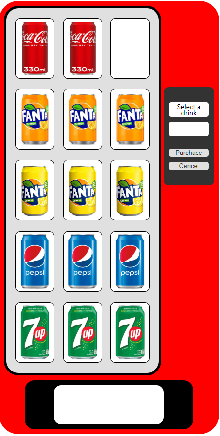

# Drinks Vending Machine Project

Intuit - Frontend/ Full Stack developer technical assignment

This project implements a drinks vending machine using Node.js and React with TypeScript, integrating the FSM (Finite State Machine) library to manage state transitions within the vending machine.

## Server (Node.js)

### Installation & running the Server

```bash
git clone drinks-vending-machine
cd server
npm install
npm start
```

The server will start running at `http://localhost:5000`.

### Tests

To run API tests and unit tests:
```bash
npm test
```

### Endpoints

- **GET `/api/drinks`**: Fetches the list of available drinks.
- **POST `/api/purchase`**: Initiates the purchase of a selected drink.

### Structure

- `__tests__/`
	- `controllers/`
		- `drinksController.test.ts`
		- `purchaseController.test.ts`
	- `api.test.ts`
- `src/`
	- `controllers/`
		- `drinksController.ts`
		- `purchaseController.ts`
	- `data/`
		- `drinks.ts`
	- `routes/`
		- `drinks.ts`
		- `purchase.ts`
	- `index.ts`
	- `types.ts`
- `package.json`

---

## Client (React)

### Installation & running the Client

```bash
cd client
npm install
npm start
```

The client will run at `http://localhost:3000`.

### Dependencies

- `fsm-js-lib` (Finite State Machine library): Utilized to manage state transitions within the drinks vending machine.
Note: Currently, the library is temporarily stored inside the client folder.

### Features

- Displays a list of available drinks fetched from the server.
- Allows users to select and purchase drinks, triggering state transitions managed by the FSM library.

### Structure

- `fsm-js-lib/`
	- `src/`
		- `index.ts`
		- `hooks/`
			- `useFsm.ts`
- `public/`
- `src/`
	- `__mocks__/`
		- `mockApi.ts`
		- `mockData.ts`
	- `components/`
		- `DispenseArea/`
			- `DispenseArea.scss`
			- `DispenseArea.tsx`
		- `Drinkimage/`
			- `Drinkimage.scss`
			- `Drinkimage.tsx`
		- `DrinkItem/`
			- `DrinkItem.scss`
			- `DrinkItem.tsx`
		- `InfoPanel/`
			- `InfoPanel.scss`
			- `InfoPanel.tsx`
	- `config/`
		- `drinksMachine.ts`
	- `hooks/`
		- `useDrinksMachine.ts`
		- `useFetchDrinks.ts`
	- `pages/`
		- `DrinksMachine/`
			- `DrinksMachine.scss`
			- `DrinksMachine.tsx`
			- `utils.ts`
	- `types/`
		- `hooks.ts`
		- `index.ts`
	- `utils/`
		- `data.ts`
	- `App.scss`
	- `App.tsx`
	- `index.scss`
	- `index.tsx`
- `package.json`

### Screenshots


---

### Additional Notes

- Implemented simulated client-side server responses to facilitate offline testing of the application's use cases and to support GitHub Pages.
- A working demo deployed as a [GitHub page](https://peshibloy.github.io/drinks-vending-machine/).

---

### What's next 
1. Implement loading state display.
2. Enhance error messaging for purchase failures.
3. Introduce unit tests for React components.
4. Integrate with a real database.
5. Separate fsm-js-lib into its own repository and publish it on NPM.
